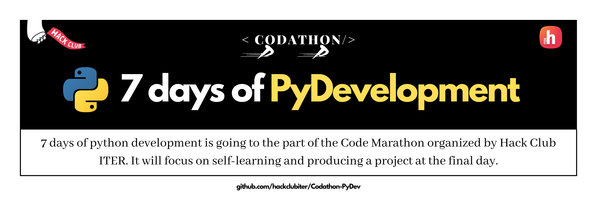

7 days of Python Development is a part of the part of Code Marathon organized by hack Club ITER. It is a marathon which will focus on self-learning and producing a project at the final day.

## Quick Links:
1. [Python Documentation](https://docs.python.org/3/)
2. [Python Basic Tutorial](https://www.w3schools.com/python/)
3. [Python DSA](https://www.geeksforgeeks.org/tag/python-dsa-exercises/)

## About
Welcome to this 7 days of Python Development!👋

It is an initiative for people to learn how to learn python, irrespective of their current level of expertise. ✌ 

The main objective behind this program is to provide you with access to top-notch content at zero cost. ✨

It'll be a week long intensive and hardcore learning marathon. 

We have designed beginner-friendly lessons covering the Python. The topics have been distributed over the course of 6 days. 

And then for the last and final day of this event, all the participants will have to submit a project which they must make within that week only. No previously prepared project will be accepted. 

Furthermore, there are quizzes to be conducted at the end of each day to help you sharpen your basics in a fun and riveting way. 💛

So see you at the end of this week. 👍

## Days-wise plan
- Day-0 : Installation
- Day-1 : Print `hello world`, Data Types, Operators
- Day-2 : Conditions & Looping
- Day-3 : List, Dictonaries, Tuples

## Day-wise Plan Links
- [Day-00](https://github.com/hackclubiter/Codathon-PyDev/blob/main/Day-00/README.md)
- [Day-01](https://github.com/hackclubiter/Codathon-PyDev/blob/main/Day-01/README.md) 
- [Day-02](https://github.com/hackclubiter/Codathon-PyDev/blob/main/Day-02/README.md)
- [Day-03](https://github.com/hackclubiter/Codathon-PyDev/blob/main/Day-03/README.md) 
- [Day-04](https://github.com/hackclubiter/Codathon-PyDev/blob/main/Day-04/README.md)
- [Day-05](https://github.com/hackclubiter/Codathon-PyDev/blob/main/Day-05/README.md)
- [Day-06](https://github.com/hackclubiter/Codathon-PyDev/blob/main/Day-06/README.md)

## Coordinators
1. Saswat Samal
2. Sanket Sanjeeb Pattanaik
3. Raj Karan Swain
4. Saswat Mohanty

## FAQs
- **Are there any prerequisite for this event?**

    There are no prerequisities for the event. Just your inquisitiveness and eagerness to learn.
- **Is it free to attend**

    Yes, it is completely free to attend.
- **Is there any exam?**

    Yes, to test your knowledge, we will conduct quiz everyday.

## Perks:
- Certificate of Appreciation to top 3 performers
- Certificate of Participation to all participants who will successfully submit their assignment and project.
- Bagful of knowledge

## Contact
- [Mail](mailto:hackclubiter@gmail.com)
- [Instagram DM](https://www.instagram.com/hackclubiter/)
